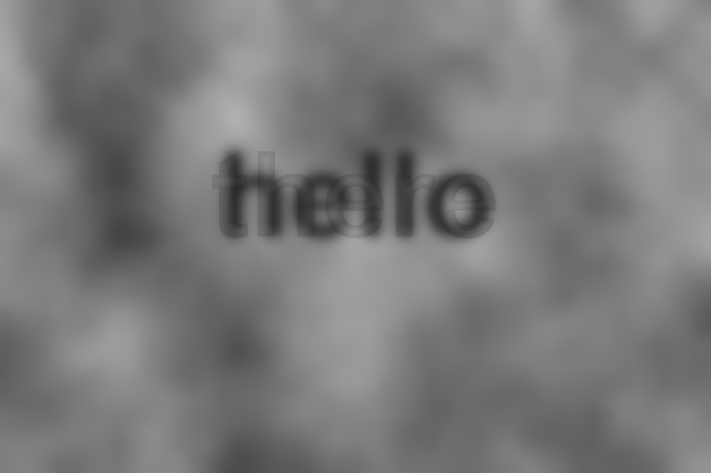
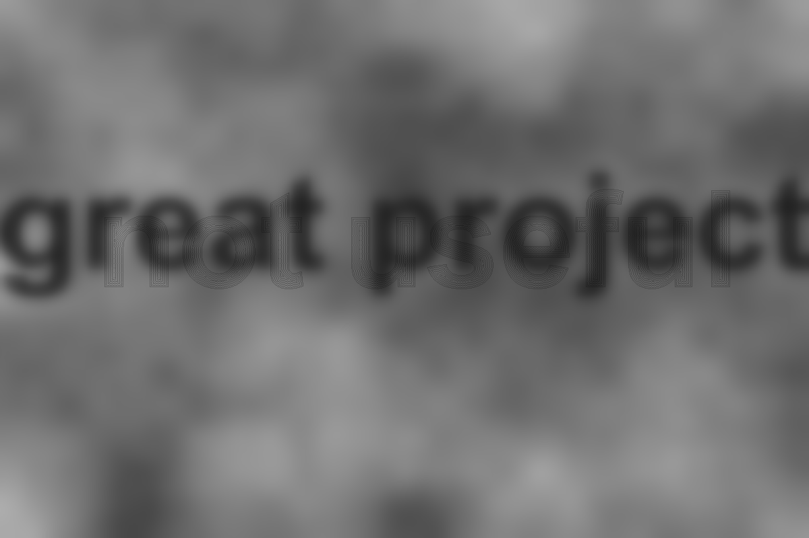

# hybrid-text
 
Experimental processing sketch to make the hybrid image visual effect
with different text.

## Examples

## Explanation

There are two types of text rendered, the close up (high frequency) and distant (low frequency) text. For viewers of the image the high frequency image will be more prominent at closer distances, while the low frequency image will be more apparent at greater distances (or when squinting their eyes).

High frequency text is drawn into a PGraphics object (without anti-aliasing), then the edges are identified and added to ahashset. We then do something like a flood fill to determine the minimum manhatten distance from the edge of the text to any pixel inside the text. Using this data we can produce effects that will help emphasise the text, when up close the viewer but will appear faint from afar.

Low frequency text is just normal text ran with a gaussian blur over it.

Everything is viewed on with perlin noise background.